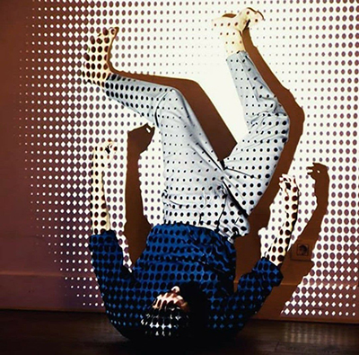

# Cuerpo Remediado
 En este repositorio se encuentran los ejercicios del taller de interactividad y cuerpo.

## Slides

<https://docs.google.com/presentation/d/1q4ATepbuUnKqU6-4rVXErL10PGsk1ZT5JEgx1fhNxEU/edit?usp=sharing>

## Materiales del concurso

<https://github.com/JoakuDeSotavento/dance-the-cloud/tree/main/materiales>

## Libros

Esta es una selección de los mejores libros para estos menesteres

--------  drive.google.com/file/d/1EdUHApmi8gDPhFTLEqCSNj-p55fkkJvF/view?usp=sharing -------------

## Ejemplos

<https://arterobotico.com/blog/>

## Autores

**Alfredo Miralles**

Madrid, 1987. Intérprete de danza contemporánea y gestor cultural. Su trabajo en producción de artes escénicas aúna sus dos trayectorias profesionales: la danza y la gestión de proyectos. Combina su trabajo desde 2009 en el Aula de las Artes de la Universidad Carlos III de Madrid con la escritura y reflexión en torno a la danza, principalmente como crítico en la Revista SusyQ. En la actualidad está inmerso en la búsqueda de un lenguaje propio en la creación audiovisual en combinación con el arte del movimiento.

[Instagram](https://www.instagram.com/alfredomiralles) |
[YouTube](https://www.youtube.com/user/alfredomirallesbenit) |

**Joaquín R. Díaz Duran**
aka **Joaku de Sotavento**

Joaquín Díaz Durán (1982, Ciudad de México) actualmente cursa el programa de Doctorado en Investigación en Humanidades Artes y Educación de la UCLM (España). Desarrolla su investigación Inside The Stomach of a Robot en vinculación a Medialab-Prado.
El año pasado presentó su trabajo con la Interfaz Cyborg en los festivales Scratxe#13 en Vitoria-Gasteiz, Ctrl Art Supr en el Hostal Bastardo en Madrid y en colaboración con el cineasta Francisco Bouzas presentan la performance Un Juego Latente en Tabakalera-Donostia. Ha impartido talleres de arte interactivo, diseño de interfaces y robótica en la Fundación Telefónica de Madrid (Marzo 2019), en MediaLab Prado (Abril y Diciembre 2019) y en el Festival Future Places, Portugal (Octubre 2017). Del 2012 al 2015 formó parte del equipo de robótica del laboratorio de Birobotics de la UNAM encargado del diseño y construcción de la apariencia del robot Justina, participando en los concurso Robocup (México 2012, Holanda 2013, Brasil 2014 y China 2015) y RockIn (Portugal 2015).

[twitter](https://twitter.com/joaku_Sotavento) |
[web](https://www.arterobotico.com) |
[github](https://github.com/JoakuDeSotavento) |
